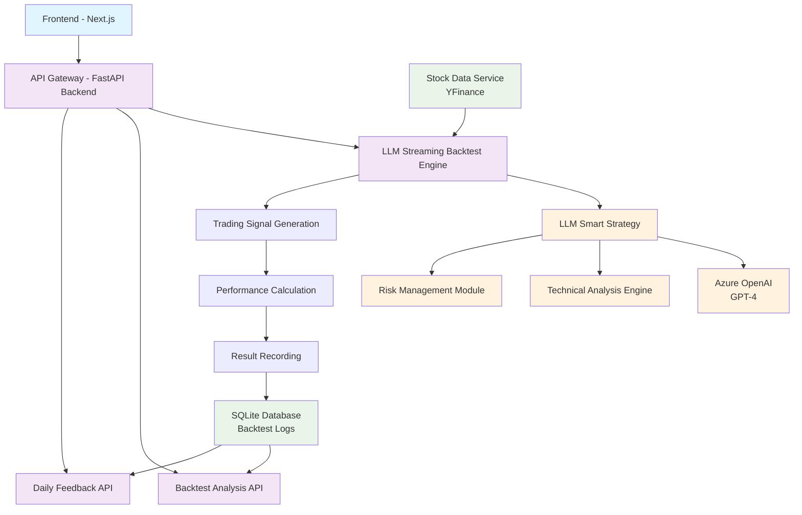

# LLM Agent Trader
AI-powered stock trading backtesting system that integrates Large Language Models for intelligent trading decision analysis.

## System Architecture



## Quick Start

### Prerequisites
- **macOS/Linux**: Native support for `make` commands
- **Windows**: May require additional setup (WSL, Git Bash, or make utility installation)

### Install Dependencies

```bash
make install
```

### Environment Setup
Copy and configure your `.env` file:
```bash
cp .env.example .env
```

**Switch LLM Provider**: Edit `.env` and comment/uncomment the API keys:
```env
# Use Azure OpenAI (default)
AZURE_OPENAI_API_KEY=your_key
# GOOGLE_API_KEY=your_key  # comment out

# Use Google Gemini instead
# AZURE_OPENAI_API_KEY=your_key  # comment out  
GOOGLE_API_KEY=your_key
```

### Development Mode
```bash
make run
```

**🎉 Success!** After setup, open your browser and navigate to:
**http://localhost:3000** to access the web application

### Manual Start (without make)

- Frontend
  - `cd frontend`
  - `npm install`
  - `npm run dev`
  - App: `http://localhost:3000`

- Backend
  - `uv run uvicorn --app-dir backend app.main:app --reload --port 8000`
  - API: `http://127.0.0.1:8000`

### Environment Variables
- Create and fill `.env` at project root (do not commit secrets)
- Example providers:
  - `AZURE_OPENAI_API_KEY=...`
  - `GOOGLE_API_KEY=...`

### Common Issues
- If the frontend shows a hydration mismatch, test in a private window or disable extensions that inject DOM attributes.
- If the dev server 500s, remove `.next` (`rm -rf frontend/.next`) and restart `npm run dev`.
- If you see `Error: Cannot find module '.../frontend/dev'` after running `npx run dev`:
  - Use `npm run dev` in `frontend` instead. `npx run dev` installs a package named `run` and tries to execute a file named `dev`, which does not exist.
  - Alternatively, run `npx next dev` to start Next.js directly.
- If `next: command not found` appears during `make run`:
  - Run `make install` first (or `cd frontend && npm install`) to install Next.js and dependencies.
  - Then start again: `make run` or `cd frontend && npm run dev`.
- If backend shows `Address already in use`:
  - Stop existing processes: `make stop`.
  - Or kill port manually: `lsof -ti:8000 | xargs kill -9`.
  - Start again: `make run` or `uv run uvicorn --app-dir backend app.main:app --reload --port 8000`.
- If `uv` is not found:
  - Install uv (Python package manager): `pipx install uv` or `pip install uv`.

### Other Commands
```bash
make stop     # Stop all services
make test     # Run tests
make clean    # Clean cache files
make format   # Format code
```

### Windows Users
If you encounter issues with `make` commands on Windows, consider:
- **WSL (Windows Subsystem for Linux)**: Recommended approach
- **Git Bash**: Included with Git for Windows
- **Make for Windows**: Install GNU Make utility
