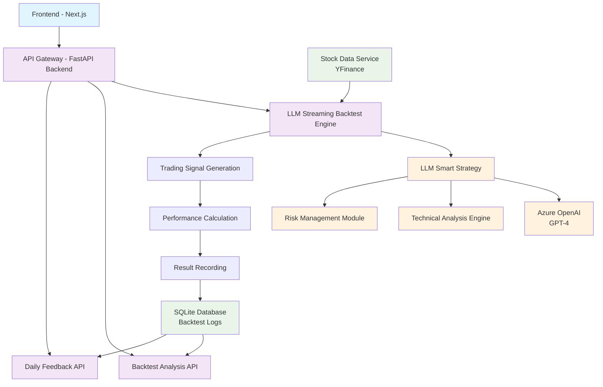

# LLM Agent Trader
AI-powered stock trading backtesting system that integrates Large Language Models for intelligent trading decision analysis.

## System Architecture



## Quick Start

### Prerequisites
- **macOS/Linux**: Native support for `make` commands
- **Windows**: May require additional setup (WSL, Git Bash, or make utility installation)

### Install Dependencies

```bash
make install
```

### Environment Setup
Copy and configure your `.env` file:
```bash
cp .env.example .env
```

**Switch LLM Provider**: Edit `.env` and comment/uncomment the API keys:
```env
# Use Azure OpenAI (default)
AZURE_OPENAI_API_KEY=your_key
# GOOGLE_API_KEY=your_key  # comment out

# Use Google Gemini instead
# AZURE_OPENAI_API_KEY=your_key  # comment out  
GOOGLE_API_KEY=your_key
```

### Development Mode
```bash
make run
```

**🎉 Success!** After setup, open your browser and navigate to:
**http://localhost:3000** to access the web application

### Other Commands
```bash
make stop     # Stop all services
make test     # Run tests
make clean    # Clean cache files
make format   # Format code
```

### Windows Users
If you encounter issues with `make` commands on Windows, consider:
- **WSL (Windows Subsystem for Linux)**: Recommended approach
- **Git Bash**: Included with Git for Windows
- **Make for Windows**: Install GNU Make utility
